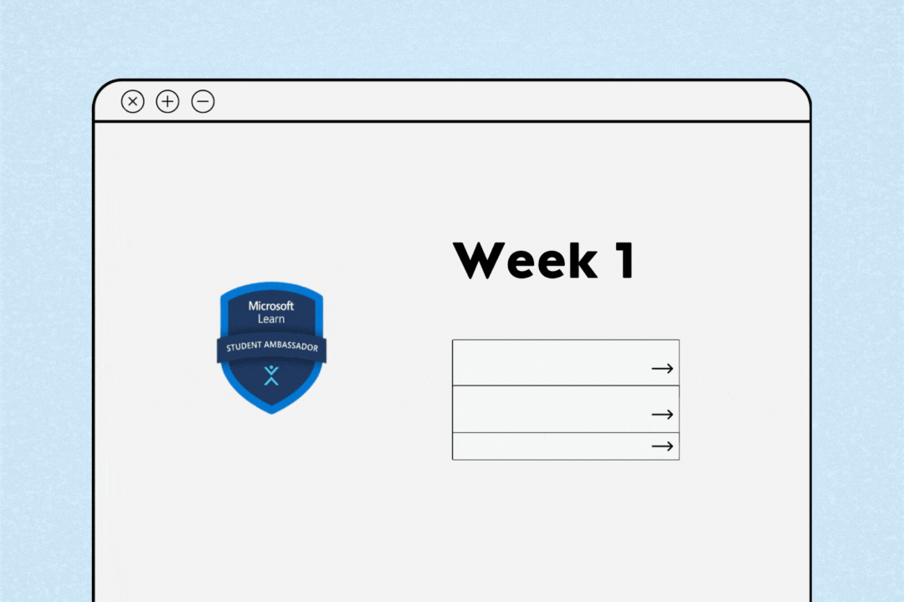

# :pushpin: Week 1 | Gear Up

  

<h4> Welcome to Week 1. Did you make noise on Social Media about getting into the program? Tell us about it <a href="https://forms.office.com/r/b9D8ZMpuMR">here</a>. Yet to do that? Don't be shy, take a moment to talk about it. Share this <a href="https://getdp.co/mlsamp">image</a> using the hashtag <a href="https://twitter.com/hashtag/mlsamp" >#mlsamp</a>, see a sample <a href=https://twitter.com/devgenix/status/1649022294289788931 >tweet here</a>. (Heads up, it's one of the things you'll be learning about soon.) </h4>

## Now, let's begin :fire:

In Week 1, we’ll introduce you to the MLSA Program, its benefits and responsibilities as well as Leadership, what it entails and how MLSAs are Leaders. You’ll learn of past and current Student Ambassadors, highlighting their achievements and how they’ve made a difference by being a Student Ambassador. Then you’ll learn about the necessary skills needed to become a successful applicant, including technical skills and personal branding.
You’ve been assigned a Mentor who'll be your guide and go-to for support throughout the program, reach out to them if you need help or ask your questions in the general Workspace. 

# But first...
A welcome note from one of our Program Managers at Microsoft.

## Next, continue to [What is the MLSA Program? :arrow_right:](./1_mlsa.md)
