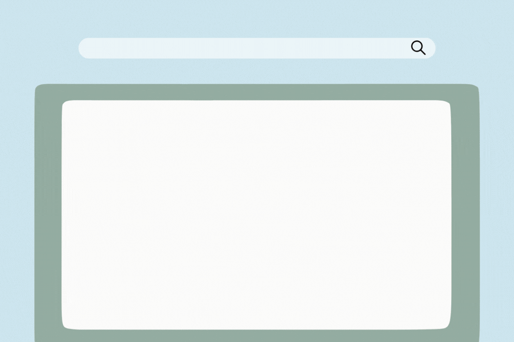

# :mag: What is the Microsoft Learn Student Ambassadors Program?

 

<h3> I mean that's what we are all here about, right? In a sentence, a Student Ambassador is Student Leader and the Student Ambassadors Program empowers you to develop and become the leader in you with support from Microsoft. <h3>
  
  ## History
  Formerly called Microsoft Student Partners and renamed in 2020 to Microsoft Learn Student Ambassadors, the Microsoft Learn Student Ambassadors Program was founded in 2001 (when some of you had not been born yet) and operated in fifteen countries for five years. Then towards of the year 2006, the Program expanded to fifty countries worldwide and has continued to expand since then. As at July, 2010 there were more than 2800 members worldwide across 100 countries and regions.
  
  ## Why MLSA?
  
  The Microsoft Learn Student Ambassadors Program was created by Microsoft to empower and engage students with the latest technologies and resources, allowing them to develop their skills and explore career paths in the technology industry.
  
  
  The program was designed to provide a platform for students to learn and showcase their skills and knowledge, and to share their experiences and insights with other students and the wider community. Through the program, students can connect with other like-minded individuals and professionals, and gain access to various learning resources, including Microsoft technologies and tools, workshops, and training.
  
  
  In summary, the Microsoft Learn Student Ambassadors Program aims to foster a strong community of student leaders who are passionate about technology and who can inspire and mentor others to develop their own skills and achieve their goals.
  
  Learn more from [Microsoft Learn Student Ambassadors in Kenya](https://www.youtube.com/watch?v=b42OE4Pac9k)
  
  ## Benefits
  
  Honestly there's a lot and most Student Ambassadors do not get to exhaust the benefits of the Program before they leave because they either joined toward the end of their Studentship in School, or they just couldn't exhaust it as different things apply to different persons depending on your career path. Sometimes it's the both of them. Here are some of the benefits:
  
  - Access to Microsoft 365, plus TechSmith Snagit and Camtasia screen capture and recording software.
  - Visual Studio Enterprise subscription and $150 monthly Azure credits.
  - Free Microsoft Certification Exam Vouchers
  - Linkedin Premium
  - Linkedin Learning
  - Free domain name
  - Access, Network and Engagement with Microsoft Cloud Advocates, Microsoft MVPs and Microsoft Employees.
  - Student Ambassador Milestone badges to highlight program accomplishments on your LinkedIn profile.
  - Event organising support.
  - Building your Leadership and Public Presentation skills.
  - Speaking enagements at Microsoft and/or third-party events.
  - Exclusive access to opportunities, resources and events.
  - Community Building and Management experience.
  - Increased Internet Visibility.
  - Am amazing swagbox.
  
  In summary, It's safe to say what benefits you get depends on just how much you are aware of and utilize while you are in the Program. So should you become a Student Ambassador, make the most of it.  
  
  **Benefits varies with different levels or milestones you attain after becoming a Microsoft Learn Student Ambassador.**
  
  ## Membership
  
  #### **Eligibility Criteria:**
  
  To apply to become a Student Ambassador, you must:
  - Be at least 16 years old at the time of application
  - Be enrolled full-time in an accredited academic institution (e.g. College, University), for an undergraduate or postgraduade degree.
  - Be an individual person (not a corporate entity)
  - Not be a Microsoft employee or current contractor
  
  #### **Timeline:**
  
  You can fill out the program application online and you can apply on all the 365 days of the year at any time of the year, according to your convenience.

New students are accepted into the program quarterly and the results are also announced on quarterly basis. 
  Take note that the application deadline varies:
  
  - If you are applying at the start of the year, apply before February 28.
  - If you want to apply after February 28, then apply before the end of June.
  - If you apply after the end of June, apply before the end of August.
  - If you apply after August, apply before November 30.
  
   
  
  **This is only an estimate based on the observed pattern, it may vary without notice. When you apply, the application deadline would be on the Application page, use that as a source of truth.**
  
  #### **Selection Criteria:**
  
  Without spilling the tea, the selection criteria is dynamic and it depends on your skills.  
  First, we want to know who you are and if your public image is fit to represent Microsoft as a Student Ambassador.  
  You should focus on your profiles on LinkedIn, GitHub, Twitter, Instagram, and Stack overflow. Any, some or all of them is fine. If you have content writing and publishing skills, such as video content creation on YouTube/Tiktok, writing blogs, and are involved in student communities, then it plus point.  
  If you have hosted events and have public speaking skills, If you do run a community or is actively involved in managing one, that's another plus point.
  
  ## Activities
  
  Microsoft Learn Student Ambassadors are responsible for building, leading and managing technical communities in their campus and to share the knowledge they gain among the academic community by hosting different workshops, meetups, hackathons and mentoring fellow students by giving presentations and initiating projects.
  
  # Let's bring this home, who are we really?
  
  In Nigeria we are a family of over 150 Student Ambassadors, making us the largest in Africa and second-largest in the world after India.
  In the next page, you'll learn about Microsoft Learn Student Ambassadors in Nigeria and highlights of our activities and stories. Check back here tomorrow.
  
  <!-- ## Continue to [Student Ambassadors in Nigeria :arrow_right:](./1_mlsa.md) -->
