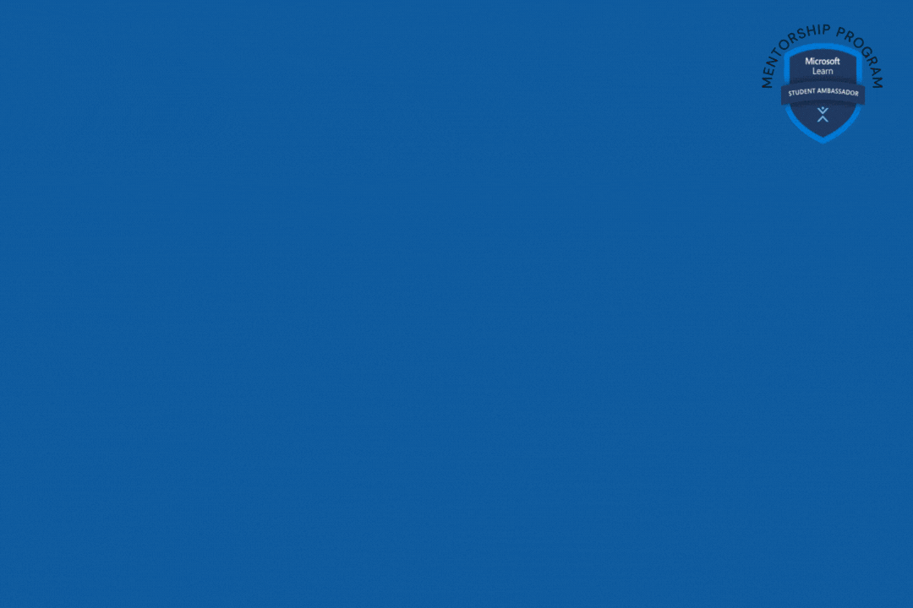

# :mag: Microsoft Learn Student Ambassadors in Nigeria

 

<h3> As I write this, it's raining and it's beautiful, and I think that describes Student Ambassadors in Nigeria. We are beautiful, literally and otherwise, and we make it rain with our activities in the Nigerian Tech Ecosystem.  <h3>
  
  ## History
  In Nigeria, the Microsoft Learn Student Ambassadors Program started out around the secound decade of the 21st Century. Since it's onset in Nigeria, we've grown to become a family of over 150 Student Ambassadors spread across the 6 geopolitical zones in Nigeria. 
  
  ## Who us?
  
  You can find all current Microsoft Learn Student Ambassadors [here](https://studentambassadors.microsoft.com/en-US/search?target=Profile). To Find those in Nigeria, in the Filter tab, select Nigeria from the Country/Region dropdown and you'll see all current Student Ambassadors in Nigeria. 

  ## Our activities

  Over the last year, we have done the following collectively as Student Ambassadors in Nigeria directly by being majorly involved in part or in its entirety: 

  - GitHub Field Day Africa - 2022
  - DataFest Africa - 2022
  - Azure Nigeria Conference - 2022
  - Global Power Platform Bootcamp - 2022 and 2023
  - Techies Meetup ( Microsoft ADC Office Lagos ) - 2023
  - GitHub Octernship - 2023
  
  ## Student Ambassadors Stories - Past Student Ambassadors. 
  
  In Nigeria, we are:

  - Rita Okonkwo, who was once a Student Ambassador at University of Lagos and is now a Software Engineer at Microsoft - [Linkedin](https://www.linkedin.com/in/rita-okonkwo/)
  - Chisom Nwokwu, once a Student Ambassador at University of Nigeria, Nsukka and is now a Software Engineer at Microsoft - [Linkedin](https://www.linkedin.com/in/chisom-c-nwokwu-4b5787186)
  - Japhlet Nwamu, once a Student Ambassador at University of Benin who graduated last year, and is now an Academic Cloud Advocate at Microsoft - [Linkedin](https://www.linkedin.com/in/japhletnwamu/)
  - Olumide Ogundare,  who currently works at Microsoft's Engineering Office in Dublin as a Software Engineer. He graduated from the University of Lagos, read his story [here](https://techcommunity.microsoft.com/t5/student-developer-blog/meet-a-recent-microsoft-learn-student-ambassador-graduate/ba-p/2423358). See him on [Linkedin](https://www.linkedin.com/in/olumideogundare/)
  - Rachel Irabor, who is currently Data Analyst at KPMG. Read her story [here](https://twitter.com/TheOyinbooke/status/1647950576141959168?t=kwYQ1hJLfDlcuWfq63b9RA&s=19)
  
  ## Student Ambassadors Stories - Currently Student Ambassadors. 
  
  In Nigeria, we are:
  
  - Salim Oyinloa. He's everywhere and doing amazing things that only referencing one of his profiles is not enough, find him [here](https://www.google.com/search?q=Salim+Oyinlola)
  - Bunmi Akinremi, a Machine Learning Engineer and Gold Microsoft Learn Student Ambassador at Obafemi Awolowo University. Among her many notable activities, is her presenting her papers at the biggest AI conference in Africa, [Deep Learning Indaba at Tunsia last year](https://www.linkedin.com/feed/update/urn:li:activity:6968456252624416769/) and [presenting a project on Plastic Waste Detection and Analysis with Drones in Rwanda](https://www.linkedin.com/feed/update/urn:li:activity:6955467888304492545/). Find her on [Linkedin](https://linkedin.com/in/bunmi-akinremi)
  - [Hammed Babatunde](https://www.linkedin.com/in/hammed-babatunde-idris/). Hammed is a Gold Student Ambassador at the University of Lagos who among many things is a DevOps professional and Operations Manager at Chimoney
  - [Flora Oladipupo](https://www.linkedin.com/in/flora-oladipupo/recent-activity/shares). Star girl Flora is a Student Ambassador at Federal University of Technology Akure and a Data Analyst. She's one person who is always out to help others in their Tech journey, from writing articles on [Microsoft's blog](https://techcommunity.microsoft.com/t5/user/viewprofilepage/user-id/1440506#profile), and other platforms to creating [video contents on Microsoft ADC YouTube](https://www.youtube.com/shorts/mfdZhEFN9Uw), to hosting events and speaking at events. At the just concluded Global Power Platform 2023, she spoke on [Optimizing your career as a Data analyst with Power platform technology.
](https://www.linkedin.com/posts/flora-oladipupo_powerplatform-activity-7059544686599770113-htDh)
  - [Sarah Solarin](https://www.linkedin.com/in/sarahsolarin/). Sarah is a pioneer Student Ambassador at Babcock Univerity and a Software Engineer at Moni. She pretty much summed up everything about her [here](https://medium.com/@solarinsarah3/year-in-review-sarah-eec26a8daee8)
  - [Osinachi Chukwuajama](https://www.linkedin.com/in/chukwujama-osinachi/?originalSubdomain=ng). Osinachi is a Software Engineer at Patricia and Gold Student Ambassador at the Federal University of Technology Owerri. 
  - [Stephen Praise](https://www.linkedin.com/in/agboola-stephen-praise/). Stephen is awesome Motion Desiginer, essentially a magic designer that has been a backbone of our designs at MLSA Nigeria. He's currently a Gold Student Ambassador at the University of Illorin and Motion Design Intern at Brangic Studio. 

Student Ambassadors in Nigeria are amazing people and we cannot mention them all here. We hope you get to meet them when you become a Student Ambassador and become an exceptional Student Ambassador yourself. 

  ## Continue to [Student Ambassadors in Nigeria :arrow_right:](./3_mlsa_milestones.md)
  
  You've been hearing Beta, Gold, what are they and what do they mean?
