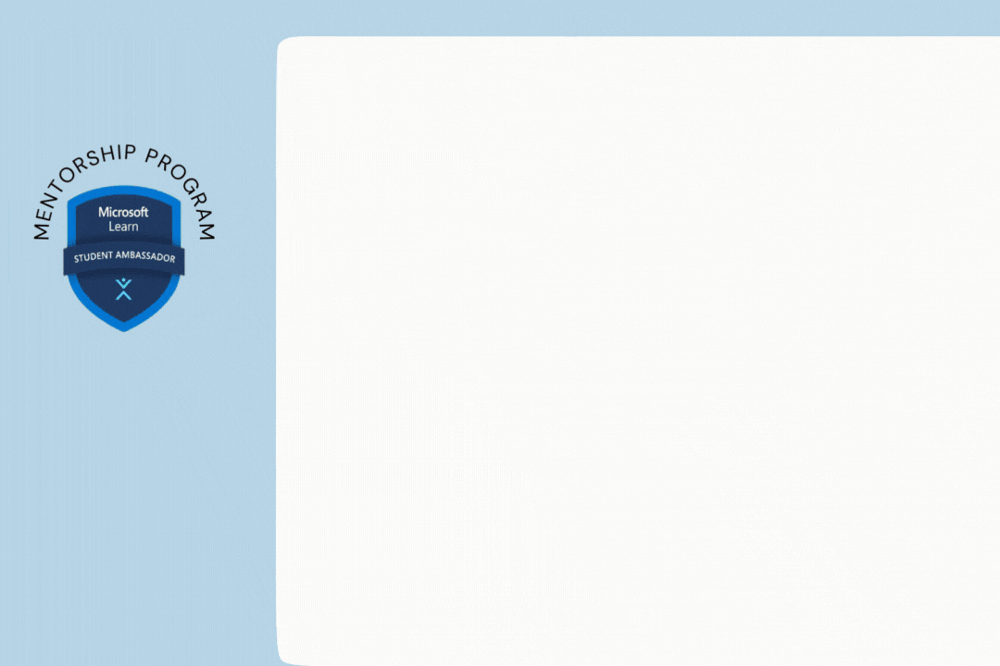
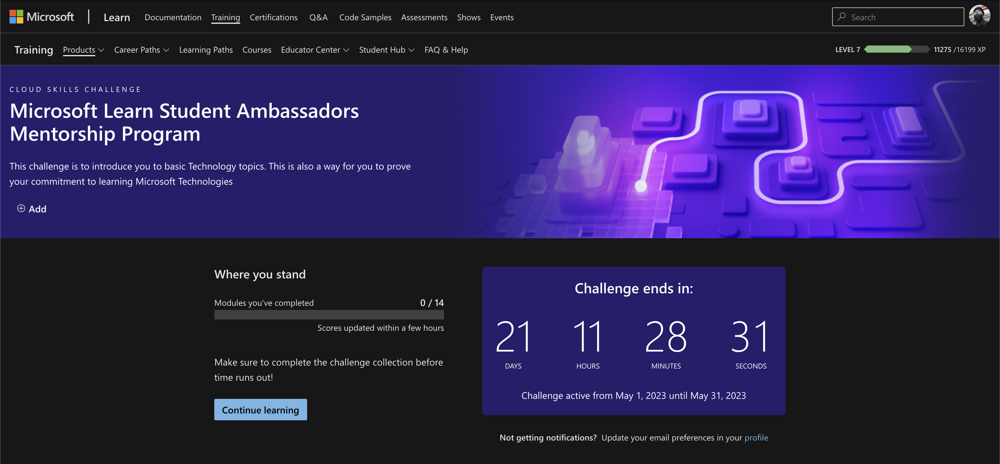
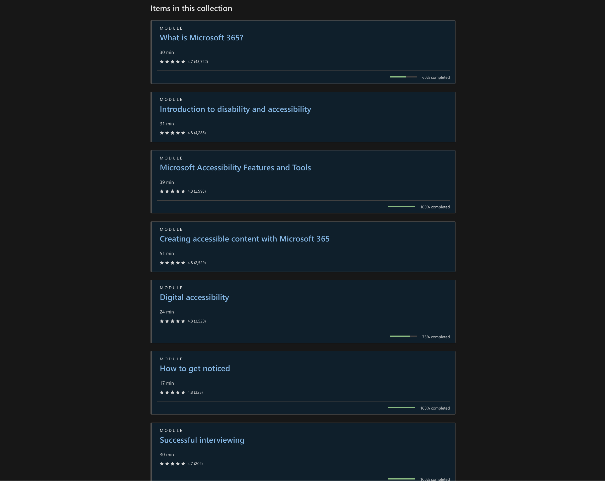
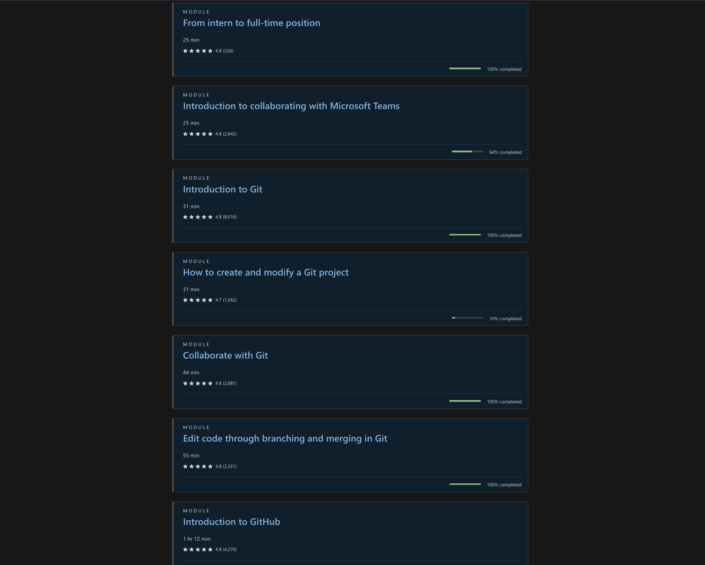

# :ok_woman: (Technical) Skills and Capabilities

 

<h3> Hehe, don't fear, it's not necessarily Programming skills. When you are in the capacity to lead, you need to be capable by having capabilities and you need to have skills to serve others, otherwise even if your service is selfless it is also insignificant. (Wisdom MLSA :joy:). Okay enough of the pun, I hope you got the point.  <h3>

# Skills, Abilities, and Capabilities: What's the Difference?

Did you know that skills, abilities, and capabilities are not all the same thing? While skills are a bit different from the other two, it's easy to mix up abilities and capabilities. Let's break it down in simpler terms.

Skills: Skills are things you learn how to do by practicing, studying, or training. They are practical abilities that let you perform specific tasks well. For example, programming, writing, public speaking, or analyzing data are all skills. You can get better at skills over time with practice and experience.

Abilities: Abilities are the things you're naturally good at without much training. They're like talents that you were born with. Abilities help you learn and perform tasks easily. Some examples of abilities are problem-solving, creativity, critical thinking, or musical talent. They're broader in nature and can contribute to developing different skills.

Capabilities: Capabilities are a mix of skills, knowledge, personal qualities, and attitudes that show your overall potential to succeed. They go beyond specific skills or talents. Capabilities include things like leadership, adaptability, strategic thinking, emotional intelligence, or effective communication. They represent your capacity to perform well and handle different situations.

To put it simply, skills are things you learn, abilities are things you're naturally good at, and capabilities are a mix of everything that shows your potential. You can have skills by learning or developing your natural abilities. Your capabilities depend on a combination of skills, abilities, and your personal qualities, and they determine how well you can accomplish specific goals or a range of objectives.

# Skills, Abilities and Capabilities = Leadership required of a Student Ambassador. 

- **Leadership.**

    By now, you've probably heard about "Leadership" many times :laughing:. But what does it really mean? Well, it's not just one thing. It's a combination of different skills, abilities, and personal traits that make someone a leader.

    Some people believe that leaders are born, while others think that leaders are made. The truth is, it can be a mix of both. Leadership is a capability, but what makes you a leader can be skills you've learned, natural abilities you were born with, or a combination of both, along with your personal traits.

    As a Microsoft Learn Student Ambassador, being a leader is an important role. So, let's talk about the core skills that make someone a successful leader:

    - **Communication:** Being able to communicate effectively, both in writing and speaking, is crucial. It means being able to convey information clearly, actively listen to others, and articulate ideas in a way that is easily understood.
  
    - **Problem-solving:** Leaders should be good at finding solutions to problems. They can analyze issues, think critically, evaluate options, and make smart decisions.
  
    - **Time management:** Leaders should know how to to manage their time wisely. They are able to prioritize tasks, meet deadlines, and help their team members do the same.
  
    - **Collaboration:** Working well with others is key.Leaders should be able to work effectively with their team members, fellow ambassadors, their community and different people. This involves fostering a cooperative and inclusive environment, promoting teamwork, and valuing diverse perspectives.
  
    - **Technical proficiency:** You don't have to be a coding expert for this. As a Microsoft Learn Student Ambassador, it's important to have a good understanding of Microsoft technologies and tools. This allows you to promote and support Microsoft products and help others use them. You don't need to know everything or a specific number of things. You can choose what interests you, learn about it, and help others learn too.

        When you become a Student Ambassador, you'll have access to a variety of Microsoft technologies. You can choose the ones that align with your career goals or match your interests. They can be simple tools like [Microsoft Forms](https://forms.office.com/) for creating forms or Microsoft Word for documents or [Microsoft Outlook](https://outlook.live.com/owa/) for emails, or more advanced tools like Azure Machine Learning Studio.

        Also, you may already have some technical skills like Product Design, Graphic Design, 3D Animation, Low/No code Development, or Technical Writing. These skills can further enhance your ability to support your community and yourself with the resources provided by Microsoft to improve your skills.
  
    - **Public speaking:** Leaders as Microsoft Learn Student Ambassadors often engage in public speaking engagements. Having strong public speaking skills allows them to deliver engaging presentations, represent Microsoft effectively, and inspire and motivate others.

    - **Initiative:** Taking initiative is important for leaders to proactively identify opportunities, propose new ideas, and drive positive change. They demonstrate a proactive attitude, show a willingness to take on responsibilities, and go the extra mile to achieve results. 

    - **Adaptability:** Being adaptable is crucial for leaders as they navigate various situations and challenges. This skill enables them to adjust to changing circumstances, embrace new technologies or methodologies, and find creative solutions to problems.

    - **Empathy:** Leaders should possess empathy, which involves understanding and relating to the feelings and experiences of others. This skill helps them build strong relationships, support their team members, and create a supportive and inclusive community.
# Technical Skills.

Being a Leader as a Microsoft Learn Student Ambassador means people would expect a level of technical proficiency from you. It is a good thing to be technically proficient in one or many technology paths/topics but that can mount pressure of you and you should understand that you do not owe it to anyone to unneccessarily learn many things at once. 
    
    
    To let you in a secret, some current Student Ambassadors are only niched in one thing and you do not have to be Software/Web Developer to become a Student Ambassador. For example, some student ambassadors are only Technical Writers or Product Designers.

As said about Leadership, you do not have to know everything, nobody does and don't make that mistake. As a Leader, you can take the initiative to identify what people around you and/or your Community needs and find ways to fill that gap, for example by inviting persons who are skilled in those technology areas to teach it to your community. 

# Time to upskill. 

Some of you already posses technical skills, some do not. For this mentorship program, we created a series of handpicked technology topics for you to learn and demonstrate your commitment to living up to the role of being a Student Ambassador. It's called a Cloud Skills Challenge and don't worry it's not something like Machine Learning or 3D Animation. :laughing:

You have till the end of this month, which is when the Mentorship program ends to complete it, ideally it should take you a week to complete it and at the end of it you obtain a Certificate to brag about.

You can access it by clicking on any of the images or by using this [link](https://aka.ms/NIGMLSAMentorship).

But if you have all these skills and people do not know that you have them, that's a problem. One of the ways you can solve that is through personal branding. 

## Continue to [Personal Branding :arrow_right:](#ok_woman-technical-skills-and-capabilities)
  
