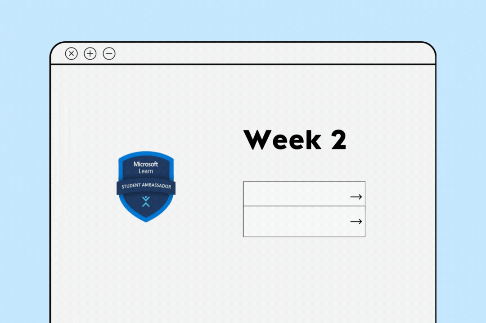

# :pushpin: Week 1 | Going further

  

<h3> Welcome to Week 2. Did you make noise on Social Media about what you learned last week? Tell us about it <a href="https://forms.office.com/r/X0L2eqehQx">here</a>. Yet to do that? Don't be shy, take a moment to talk about it. Share a summary of what you learned using the hashtag <a href="https://twitter.com/hashtag/mlsamp" >#mlsamp</a>,  don't forget to tag us on Twitter, <a href="https://twitter.com/mlsanigeria" >@mlsanigeria</a> <a href="https://twitter.com/microsoftlearn">@microsoftlearn</a> and on Linkedin, <a href="https://www.linkedin.com/company/microsoft-learn-student-ambassadors">@mlsanigeria</a> <a href="https://www.linkedin.com/company/microsoftlearn">@miccrosoftlearn</a> </h3>

## Now, let's begin :fire:

In Week 2, you will discover how to organize and promote an event. You will also learn effective communication and presentation skills to share your knowledge and thoughts with others, adapting to different situations. Your mentor will guide you in planning and promoting your event, and you will host it in the following week on a date agreed upon by you and your mentor. If you need assistance, remember to reach out to your mentor or ask questions in the general workspace. 

Let's continue to publicizing your event.
## Next, continue to [Rightly promoting your Event :arrow_right:](./1_promoting_your_event.md)
